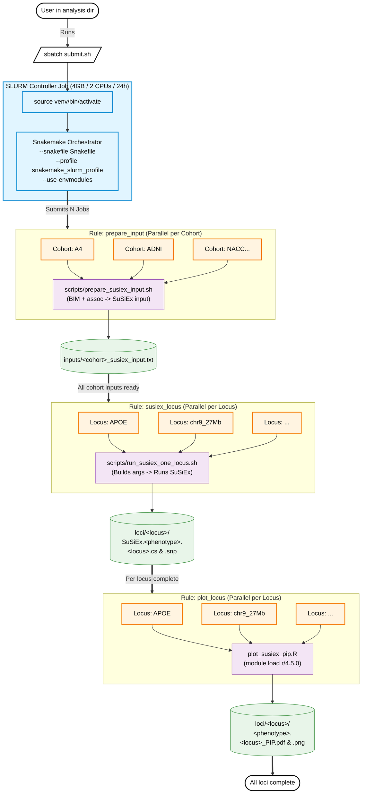

# SuSiEx Fine-Mapping Pipeline

A shared bash + Snakemake pipeline for cross-cohort statistical fine-mapping with [SuSiEx](https://github.com/getian107/SuSiEx). 

Designed for high-performance computing (HPC) environments using SLURM, this pipeline allows for a single cluster installation that multiple users can leverage. Each user can scaffold and run their own isolated analyses without interfering with the core codebase.

## 🧠 Architecture & Workflow



## 🛠️ Admin Installation (One-Time Setup)

Clone this repository onto a shared filesystem where your group has read and execute permissions.

```bash
git clone <your-github-repo-url> susiex_pipeline
cd susiex_pipeline

# 1. Edit the admin-default binary paths
vim config/pipeline.yaml                 # Set global susiex_bin and plink_bin paths

# 2. Edit the SLURM profile for your cluster's partition / account
vim snakemake_slurm_profile/config.yaml

# 3. Install dependencies and set permissions
./install.sh

# 4. Verify everything is wired up correctly
./verify_install.sh
```

## 🚀 User Workflow

Users do not need to copy the entire repository. They simply use the pipeline launcher to scaffold an analysis in their own workspace.

**1. Initialize an Analysis Directory**
```bash
mkdir ~/my_finemap_analysis
cd ~/my_finemap_analysis

# Scaffold configs and submit script
/path/to/susiex_pipeline/bin/susiex-pipeline init .
```

**2. Configure Your Analysis**
Edit the generated files to match your dataset:
* `config/pipeline.yaml`: Set your phenotype name and SuSiEx parameters.
* `config/cohorts.yaml`: List your cohorts and provide paths to `.bim` and GWAS `.assoc` files.
* `config/loci.tsv`: Define the target loci (chr, start, end).

**3. Dry-Run & Submit**
```bash
# Verify configs without executing
/path/to/susiex_pipeline/bin/susiex-pipeline dry-run .

# Submit to SLURM cluster
sbatch submit.sh
```

## 📊 Outputs

Results are organized cleanly in your analysis directory:

```text
output/
└── <phenotype>/
    ├── inputs/            # Formatted per-cohort SuSiEx inputs
    ├── loci/<locus>/      # .cs, .snp files, and PIP scatter plots (.pdf, .png)
    └── logs/              # Snakemake and per-rule execution logs
```

## 📚 Citation

If you use this pipeline, please cite the original SuSiEx methodology:
> Yuan K, Longchamps RJ, Pardiñas AF, et al. Fine-mapping across diverse ancestries drives the discovery of putative causal variants underlying human complex traits and diseases. *Nat Genet* 56, 1841–1850 (2024). doi:10.1038/s41588-024-01870-z
